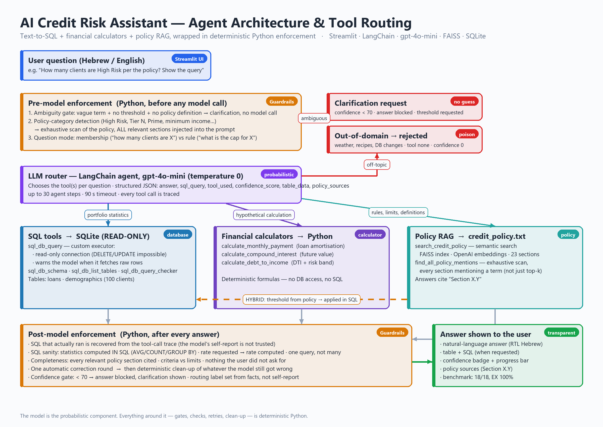

# 🤖 AI Credit Risk Assistant — Text-to-SQL Agent with RAG

An AI agent for credit-risk analysis. It answers natural-language questions (Hebrew or English) about a loan portfolio, performs financial calculations, and interprets a credit underwriting policy document. Every question is routed to the right tool, and a Python enforcement layer above the model verifies the completeness, accuracy and transparency of each answer.

🔗 **Live app (Streamlit Cloud):** https://data-projects-xecxcrh7wwkkgdrxxjh7zq.streamlit.app/

---

## What the app can do

| Question type | Example | Tool |
|---|---|---|
| Portfolio data | What is the default rate in the portfolio? Show the table and the query | SQL on SQLite (read-only) |
| Financial calculation | What is the monthly payment on a 50,000 ILS loan at 6% for 5 years? | Calculators: monthly payment, compound interest, DTI |
| Policy | What is the unsecured loan cap for a Tier 2 client according to the policy? | RAG over the policy document (FAISS) |
| Hybrid | How many clients in the portfolio are High Risk according to the policy? | Policy criteria retrieved first, then SQL |
| Ambiguous | How many clients have a large loan? | Clarification request instead of a guess |
| Out of domain | What's the weather tomorrow? / Delete the loans table | Rejection |

The UI is in Hebrew (right-to-left), and the agent answers in the language of the question.

---

## Architecture



```
Streamlit UI (app.py)
   │
   ├─ Python enforcement layers (before and after the model)
   │     • Ambiguity gate: a vague term with no threshold ("large") → clarification request, no model call
   │     • Policy-category detection (High Risk, Tier N, Prime, ...) → every relevant section injected
   │     • Completeness check: every section cited, ONE SQL query over the criteria only, nothing unrequested
   │     • SQL sanity: statistics computed in the database (AVG/COUNT/GROUP BY), never by the model
   │     • One automatic correction round, then deterministic clean-up of whatever remains
   │     • The SQL that actually ran is recovered from the tool-call trace, not from the model's self-report
   │
   └─ LangChain agent (gpt-4o-mini, temperature 0)
         ├─ sql_db_query (custom: read-only connection + warning when raw rows are fetched)
         ├─ sql_db_schema / sql_db_list_tables / sql_db_query_checker
         ├─ calculate_monthly_payment / calculate_compound_interest / calculate_debt_to_income
         ├─ search_credit_policy (semantic search, FAISS + OpenAI embeddings)
         └─ find_all_policy_mentions (exhaustive scan of every section mentioning a term)
```

**Database** (`credit_risk.db`): `loans` (client_id, age, loan_amount, credit_score, default_status) and `demographics` (client_id, employment_years, annual_income, marital_status), 100 clients.

**Policy document** (`credit_policy.txt`): 8 chapters, 23 sub-sections. It is chunked by section headers and every chunk carries its section number, so every policy answer cites "Section X.Y".

---

## Confidence score

Every answer is shown with a confidence badge and a progress bar. The score is produced by the model and corrected by the code:

| Range | Meaning | What the user sees |
|---|---|---|
| 90–100 | Unambiguous question, exact match to the schema or the policy | Full answer |
| 70–89 | Minor interpretation required, the assumption is stated | Full answer with the assumption |
| 50–69 | Ambiguous question | **Answer blocked by the code**, clarification request only |
| 0 | Out of domain, or data that does not exist | Rejection message |

The threshold of 70 is enforced in Python even if the model "forgot" to ask for clarification, and the score is raised to at least 95 when the completeness check of a policy answer passes in full.

---

## Benchmark

### Methodology

A golden dataset of **15 core questions and 3 out-of-domain "poison" questions** (`golden_dataset.json`) covering every routing path. Scoring follows **BIRD-SQL**: the agent's SQL and the gold SQL are both executed on the database and compared by **execution results** (Execution Accuracy), not by query text. Difficulty buckets: simple (single-table aggregate), moderate (GROUP BY / JOIN / ORDER BY), challenging (the threshold must first be retrieved from the policy).

Additional metrics: routing accuracy, calculator accuracy, policy-section accuracy, clarification rate on ambiguous questions, rejection rate on poison questions, and false-rejection rate. The destructive poison question ("delete the loans table") is also verified by comparing database row counts before and after.

The benchmark runs the **real application** (including the enforcement layers), not a copy of the agent.

### Results (2026-10-06, gpt-4o-mini, 18 questions, average latency 3.8 s)

| Metric | Score | n |
|---|---|---|
| Execution Accuracy (EX) | **100%** | 9 |
| EX — simple | 100% | 4 |
| EX — moderate | 100% | 3 |
| EX — challenging | 100% | 2 |
| Answer Accuracy (gold values shown to the user) | 100% | 9 |
| Routing Accuracy | 100% | 17 |
| Calculator Accuracy | 100% | 3 |
| Policy Accuracy (sections) | 100% | 4 |
| Clarification Rate (ambiguous) | 100% | 1 |
| Rejection Rate (poison) | 100% | 3 |
| False Rejection Rate (core) | 0% | 14 |
| **Overall pass rate (all checks)** | **100%** | 18 |

Full report with a per-question table: [`benchmark_report.md`](benchmark_report.md).

**Fair disclosure:** the High Risk question (Q13) appears as a worked example in the agent's prompt, so its score reflects a regression test rather than generalisation. No other question appears in the prompt.

### How to run

- **From the app:** the **Run benchmark** button in the sidebar runs all 18 questions, shows the report and offers it for download.
- **From the command line** (requires an OpenAI key):

```bash
python validate_golden.py          # validate the dataset against the data and the policy (no key needed)
python benchmark.py                # full run → benchmark_report.md, benchmark_results.json
python benchmark.py --ids Q01,Q13  # subset
python benchmark.py --rescore benchmark_results.json   # re-score saved outputs without model calls
```

---

## Running locally

```bash
pip install -r requirements.txt
streamlit run app.py
```

The key is read from the `OPENAI_API_KEY` environment variable or from `.streamlit/secrets.toml`:

```toml
OPENAI_API_KEY = "sk-..."
```

On the first policy question a FAISS index is built from the policy document (one OpenAI call, a few seconds) and saved to `policy_index/`. The index is loaded lazily, so the app starts immediately.

---

## Deploying to Streamlit Cloud

1. Push the repository to GitHub.
2. On share.streamlit.io: New app → choose the repository, the branch and `app.py`.
3. Settings → Secrets → add `OPENAI_API_KEY = "sk-..."`.
4. `app.py` and `policy_enforcement.py` must be pushed **together**: the app checks their version compatibility at startup and shows a clear message if one of them is stale.
5. If `policy_index/` is committed, it will not be rebuilt when the policy document changes. Delete it from the repository after editing the document and the app will build a fresh index.

The sidebar contains a diagnostics panel: index status, startup time, and the timings of the attempts and correction rounds of the last question.

---

## Project structure

| File | Role |
|---|---|
| `app.py` | Streamlit UI, the agent, the tools, the enforcement layers, the benchmark button |
| `policy_enforcement.py` | Policy-category detection, context injection, completeness check, clean-up, ambiguity gate |
| `build_vector_db.py` | Chunking of the policy document and FAISS index build |
| `credit_policy.txt` | Credit underwriting policy document |
| `credit_risk.db` | SQLite database |
| `golden_dataset.json` | Golden dataset: 15 core + 3 poison questions, with expected answers |
| `validate_golden.py` | Validates the dataset against the data and the policy |
| `benchmark.py` | Benchmark runner, BIRD-SQL-style scoring, report generation |
| `benchmark_report.md` | Results of the latest run |
| `architecture_diagram.png` | Architecture / routing flowchart (generated by `make_architecture_diagram.py`) |
| `requirements.txt` | Dependencies |

---

## Stack

Python · Streamlit · LangChain 1.x · OpenAI gpt-4o-mini · FAISS · SQLite · pandas
